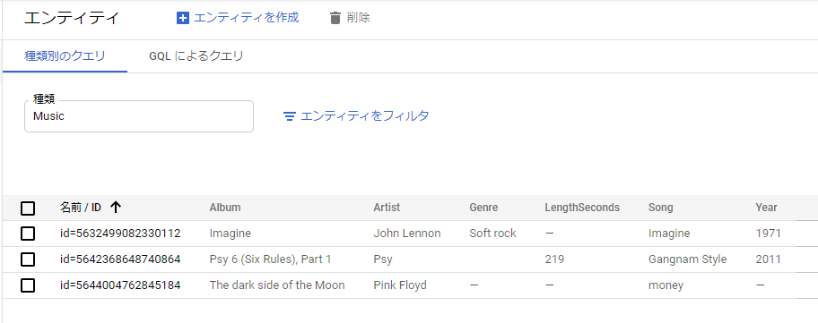

# クラウドアーキテクト・ファーストステップ - 演習補助手順

## ラボ1 Introduction to Amazon EC2 Auto Scaling

  

*インストラクターから指示があった場合はこちらの手順を参照しながら演習を進めてください。*

  

このラボでは以下のことを試します。

・起動テンプレートを作成する

・Auto Scaling グループを作成する

・Auto Scaling インフラストラクチャをテストする

・Auto Scaling 起動の結果を表示する

### タスク1:起動テンプレートを作成する

  

まずは、Auto Scalingグループを作成するために、仮想マシンのレシピとなる「起動テンプレート」を作成します。

  

1.  **画面左上の「サービス」で「コンピューティング ＞ EC2」をクリック**  
      
    
2.  **左側のナビゲーションペイン**で「インスタンス」の下にある**「起動テンプレート」**をクリック  
      
    
3.  **「起動テンプレートを作成」**をクリック  
      
    
4.  **「起動テンプレート名と説明」**で、次のように設定します。  
    **・起動テンプレート名**：Lab-template
    

**・テンプレートバージョンの説明**：version 1

※Lab-templateがすでに作成済みと表示される場合には「Lab-template2」としてください。  
  

5.  **「アプリケーションおよび OS イメージ (Amazon マシンイメージ) 」**で、次のように設定します。  
    ・**検索ボックス**に**「Amazon Linux」**と入力して**Enterキー**  
    ・「**Amazon Linux 2 AMI (HVM)」**と表示される一番上のマシンイメージの選択をクリック  
      
    
6.  **「インスタンスタイプ」**で、ドロップダウンの一覧から**「t3.micro」**を選択  
      
    
7.  **「ネットワーク設定」**までスクロールして**「セキュリティグループ」**ドロップダウンの一覧から**「MySecurityGroup」**を選択  
      
    
8.  画面の下までスクロールして**「起動テンプレートを作成」**をクリック  
      
    
9.  **「起動テンプレートを表示」**をクリック。作成したテンプレートが表示されることを確認します。  
      
    

### タスク2:Auto Scaling グループを作成する

  

次に、作成した起動テンプレートを使用してAuto Scalingグループを作成します。

今回は自動スケーリングは設定しませんが、Auto Scalingグループで設定した台数を自動的に維持するインスタンスの自動回復を試します。

  

1.  **左側のナビゲーションペイン**で下までスクロールして**「Auto Scaling」**の下にある**「Auto Scaling グループ」**をクリックします。  
      
    
2.  **「Auto Scaling グループを作成」**をクリックして、次のように設定します。  
    **・Auto Scaling グループ名**：Lab-Group
    

**・起動テンプレート：**作成した起動テンプレート（Lab-template）を選択

・**「次へ」**をクリック  
  

3.  **「ネットワーク」**で、次のように設定します。
    

**・VPC：**Lab VPC  
（ドロップダウンから最後に（Lab VPC）と記載のある方を選択）

**・アベイラビリティーゾーンとサブネット：**両方のサブネットを選択  
（ドロップダウンから表示される二つのサブネットを両方クリックして選択）  
**・「次へ」**をクリック  
  

4.  **「詳細オプションを設定」**で次のように設定します。
    

・**「ヘルスチェック」**の**「ヘルスチェックの猶予期間」**：60秒

・**「その他の設定」**の**「モニタリング」**：「CloudWatch 内でグループメトリクスの収集を有効にする」**チェックボックスをオン**

・**「次へ」**をクリック  
  

5.  **「グループサイズとスケーリングポリシーを設定する」**で、次のように設定します。
    

**・最小容量**：1

**・最大容量**：2

**・「次へ」**をクリック  
  

6.  **「次へ」を何回かクリック**して、**「確認」ページ**に移動します。  
      
    
7.  **「Auto Scaling グループを作成」**をクリック  
      
    ページが切り替わり、作成したAuto Scalingグループが表示されます。  
      
    

### タスク3:Auto Scaling グループを確認する

  

作成したAuto Scalingグループを確認してみます。

  

1.  **作成したAuto Scalingグループ（Lab-Group）**をクリックします。
    

**「詳細」タブ**でAuto Scalingグループについての情報を確認します。  
  

2.  **「アクティビティ」タブ**をクリックします。
    

ステータス列にインスタンスの現在のステータスが表示されます。

**インスタンス作成中はPreInService**と表示され、**インスタンスが作成されると、ステータスがSuccessfulに変わります。**変わらない場合は更新アイコンをクリックしてみてください。  
  

3.  **「インスタンス管理」タブ**をクリックします。
    

作成されたインスタンスの情報が表示されます。右にスクロールすると、ヘルスステータス列にEC2インスタンスヘルスチェックの結果が問題ないことを表す「**Healthy**」表示されます。

### タスク4：Auto Scaling （インスタンスの自動回復）をテストする

  

作成したAuto Scalingグループのインスタンスを終了（削除）することで、Auto Scalingグループで設定した台数を自動的に維持する、インスタンスの自動回復を試します。

  

1.  **「インスタンス管理」タブ**で作成された**インスタンスIDの値をクリック**する。
    

作成された、Amazon EC2インスタンスのページが別タブで開きます。  
  

2.  **「インスタンスの状態」**ドロップダウンメニューをクリックします。
    

・**「インスタンスを終了」**を選択（※インスタンスを停止ではありません）

・続けて**「終了」**をクリック

**・左側のナビゲーションペイン**で**インスタンス**をクリックします。

インスタンスの状態が**「シャットダウン中」**になっています。

インスタンスの状態が**「終了済み」**に変わるまで待ちます。  
  

3.  **左側のナビゲーションペイン**で**「Auto Scaling グループ」**をクリックします。  
      
    
4.  **作成したAuto Scaling グループ（Lab-Group）**をクリックします。  
      
    
5.  **「アクティビティ」タブ**を開きます。  
    最初のインスタンスの作成と終了のエントリ、続いて新規インスタンス作成のエントリが表示されることを確認できます。  
      
    
6.  **左側のナビゲーションペイン**でインスタンスをクリックします。終了したインスタンスとともに、新規に作成されたインスタンスが表示されています。
    

  

ラボ１は以上です。お疲れ様でした。
 
 
  

----------

## ラボ3Datastore: Qwik Start

  

*インストラクターから指示があった場合はこちらの手順を参照しながら演習を進めてください。*

  

NoSQLデータベースのDataStoreを試してみます。DataStoreにデータを格納し、検索してみます。オンプレミスで使用しているリレーショナルデータベースとの違いを意識しながら進めていきましょう。

  

1.  左上の [Google Cloud Platform] の横にある**ナビゲーション メニュー**をクリック

2.  Cloud Platform Console の左側のメニューの、**[Datastore] > [エンティティ] **に移動します。（Datastoreが表示されない場合はメニュー下部のMORE PRODUCTSをクリックして開いてください）
    
3.  [Datastore モード] 列で、**[Datastore モードを選択] **をクリックします。
    
4.  次に、データベースを作成する場所を選択します。プルダウン メニューを使用してt東京リージョンの**「asia-northeast1(Tokyo)」**を選択します。  
    (ここでデータベースを作成するをクリックする必要がある場合があります)  
    次のステップに進むまで1～2分ほど時間がかかります。
    
5.  **[エンティティを作成] **をクリックします。エンティティはDatastoreにおける一行のデータのような扱いです。  
    
    

6.  エンティティの作成画面に以下のように設定を行います。  
    Datastoreの種類はリレーショナルデータベースのテーブルのようなものです。  
      
    **続けてプロパティを入力します**。Datastoreのプロパティはリレーショナールデータベースの列のようなものです。  
    最初の新しいプロパティに以下のように設定を行い、**[完了]**をクリックします。**続けて、プロパティを追加をクリックし、以下の表のように3つのプロパティを設定します。**  
    

|  名前| タイプ |値|
|--|--|--|
|  Artist|文字列  |Pink Floyd|
| Song | 文字列 |money|
|  Album| 文字列 |The Dark Side of the Moon|

7.  **[作成]** をクリックします。作成した Music エンティティがコンソールに表示されます。  
    
    
8.  同様に以下の二つのエンティティを登録します。  
    **[エンティティを作成]**をクリックして登録します。  
    Datastoreはテーブル作成時テーブルの構造である「スキーマ」を設定する必要がなく、後からエンティティを追加する際に柔軟に列を定義することができます。
    
|  名前| タイプ |値|
|--|--|--|
|  Artist|文字列  |John Lennon|
| Song | 文字列 |Imagine|
|  Album| 文字列 |Imagine|
|  Year| 整数 |1971|
| Genre |文字列  |Soft rock|

|  名前| タイプ |値|
|--|--|--|
|  Artist|文字列  |Psy|
| Song | 文字列 |Gangnam Style|
|  Album| 文字列 |Psy 6 (Six Rules), Part 1|
|  Year| 整数 |2011|
| LengthSeconds |整数  |219|

9.  ３つのエンティティを設定しました。エンティティの一覧として以下のように表示されます。  
      
      
      
     

### 種類別クエリの実行

  

DatastoreではGUI画面から簡単にフィルタをかけてデータを検索することができます。

  

1.  **[種類別のクエリ]** をクリックします。(多くの場合、すでに種類別クエリ画面になっています)
    
2.  **[種類]** に **[Music]** を選択します。(多くの場合、すでにMusicが選択されています)
    
3.  **[+クエリ句を追加]** をクリックします。
    
4.  プルダウン リストで、**[Artist]、[＝文字列]、[Psy]** を選択し、**[実行]**をクリックします。1件の検索結果が表示されます。
    

  

### GQL クエリの実行

DatastoreではSQLに似たGQLというクエリ言語を使用することができます。慣れ親しんだSQLに似たクエリを実行できるため、便利です。  
  

1.  **[GQL によるクエリ]** タブをクリックします。
    
2.  クエリボックスに次のように入力します。
    

    SELECT * FROM Music

  

3.  **[クエリを実行]** をクリックします。  
    クエリの結果として、作成した Music エンティティが表示されます。
    
4.  次のクエリを実行します。
    

    SELECT * FROM Music WHERE Album = 'Imagine'

  
Album名がImagineのデータだけに絞り込むことができます。

  
  
  

ラボ3は以上です。お疲れ様でした。

  

早く終わった場合にGCPの他のサービスをのメニューを見ても構いませんが、ラボで指定された以外の仮想マシンを立てたり等、新たなリソースを作成したりはしないでください。

新たなエンティティを足してみたり、削除してみたり、クエリを実行してみたりするのは構いません。
